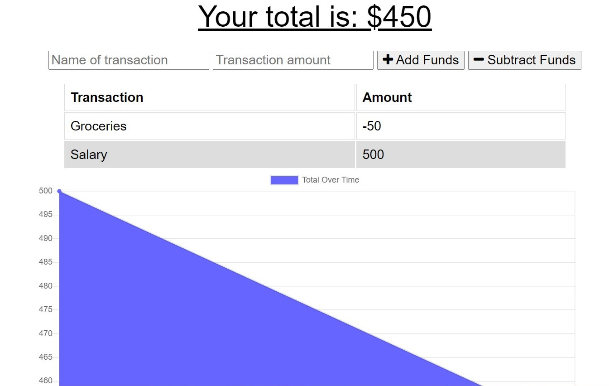
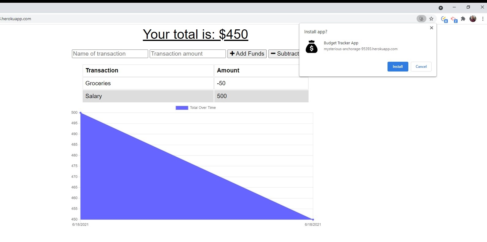
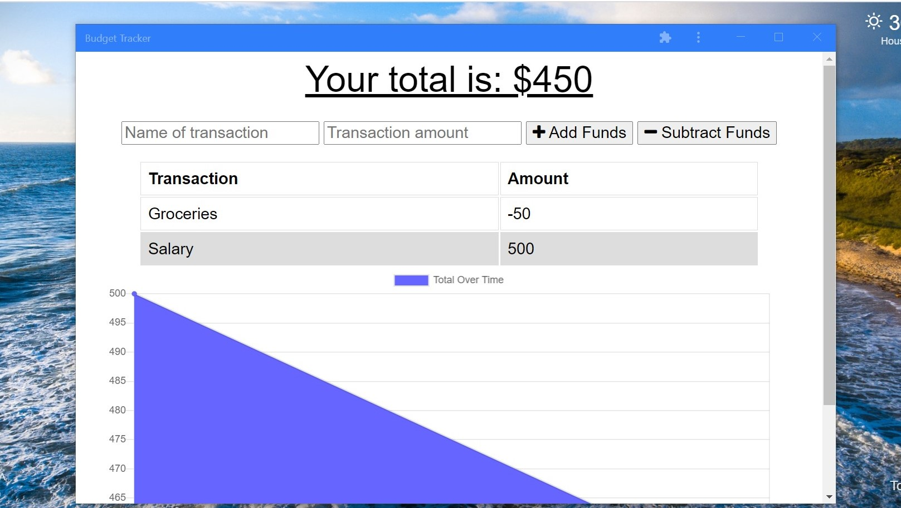
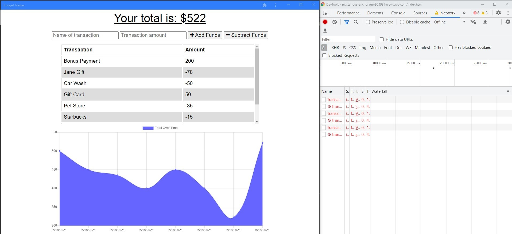
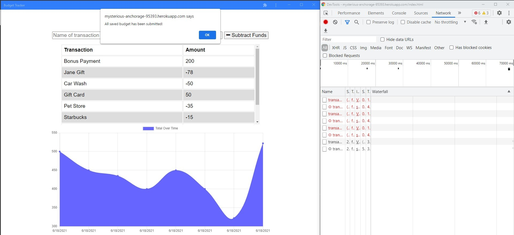

# Budget Tracker

## Description

The budget tracker has been built for users to have an easy way to track their money, having offline functionality that allows them to access that information at any time. This application allows the user to add expenses and deposits to their budget with or without a connection.

Please [click here](https://mysterious-anchorage-95393.herokuapp.com/) to be directed to the deployed application.

## Usage

Below screenshots of some of the features for reference.

- Budget Tracker landing page;

  

- Budget Tracker allows the user to install the app, as shown in the image below;

  

- After installing the app, the app will open as shown below;

  

- The Budget Tracker allows the user to add expenses and deposits to their budget with or without a connection;

  

- Once the application is back online, an alert will display confirming that all saved budget has been submitted.

  
